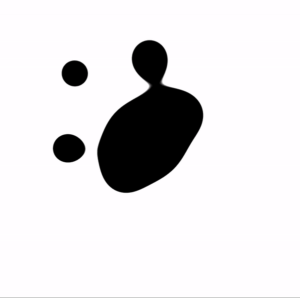
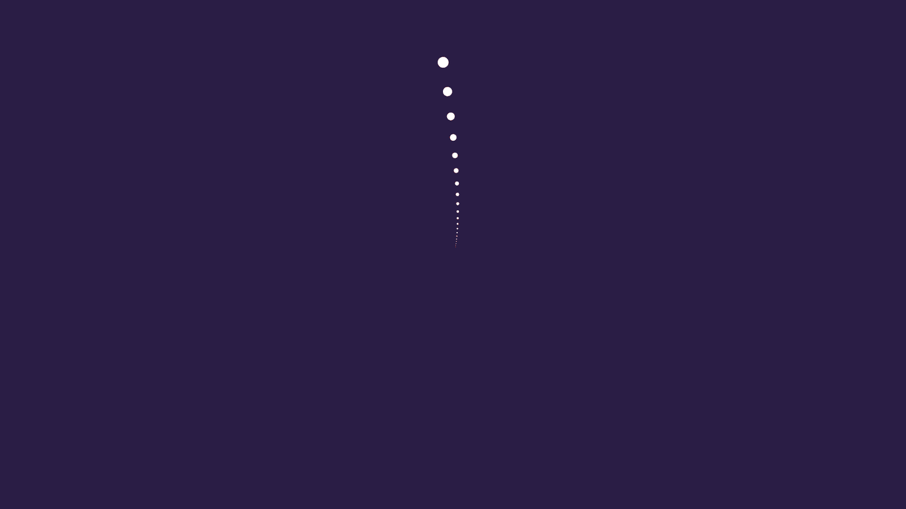
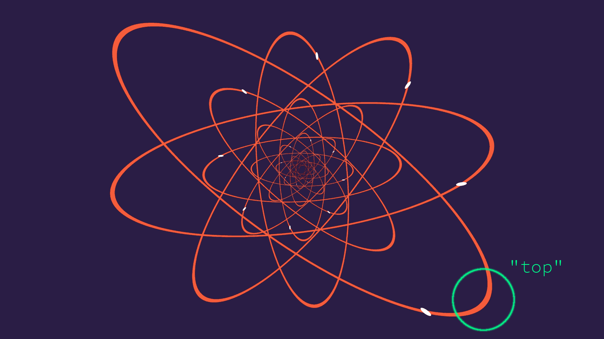
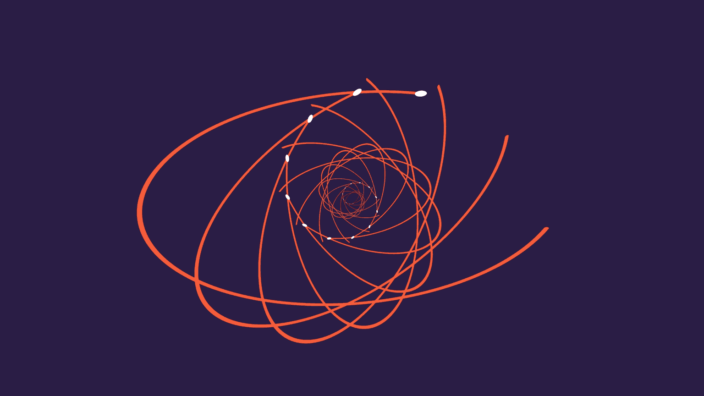

# homework-3-case-study

# Student Info

- Name: Mauricio Mutai
- PennKey: `mmutai`

# Paw Metaballs

## Reference Animation

- Taken from the [original homework repo](https://github.com/CIS-566-2018/homework-3-case-study).

## My Implementation

- [https://www.shadertoy.com/view/4s3cRM](https://www.shadertoy.com/view/4s3cRM)

## Techniques Used

### Basic Rendering

- This shader converts its fragment's coordinate to a `vec2` in NDC space (origin at the center of the image). This `vec2` is fed through a series of functions in order to determine which color it should get, based on its proximity to certain shapes.
- The extra credit performs some ray-marching to render 3D metaballs instead.

### Metaballs - Static

- As hinted by its title, the original animation appears to use metaballs to achieve the "blob" animation.
- I defined a `rawMetaball()` function (please read the comment above this function for an important warning). It simply returns the metaball's radius divided by the distance from the input position `p` to the metaball's center.
    - This function has the basic property of having a high value when `p` is inside the metaball, and low when `p` is outside it. It is always positive.

### Metaballs - Animation

- From observing the original animation, I inferred the following:
  - There is one metaball in the center, and eight metaballs moving towards and away from the center periodically.
  - The moving metaballs seem to have a sinusoidal function controlling their distance to the center.
  - Each moving metaball is offset (in terms of where it is in its animation) relative to its neighbors.
    - Since everything looks pretty uniform, this offset can be inferred to be `2 * PI / 8`, if we define it in terms of an angle in a circle.
- Using this information, I defined `aniMetaball()`, which computes a moving metaball's center given two parameters: the direction `dir` in which it is moving, and its time offset. It then returns the result of a call to `rawMetaball()` using the computed center.
    - More specifically, we compute a time-dependent `dist` value. This is the distance from the origin along `dir`. 
    - `dist` is computed using `cos()` with an adequately scaled time variable. The output of `cos()` is mapped to the range `[0, 1]`, since the original animation doesn't seem to have the moving metaballs move past the center (which would be accomplished with negative `dist` values)
    - The center is then simply `dist * dir`.
- For a given pixel with position `p`, we sum the return values of one static `rawMetaball()` and eight `aniMetaball()` calls to which we pass `p`. This gives us a `metaSum`. If this `metaSum` is above a threshold, then the pixel is said to be in a metaball (which one, we do not know).
    - In order to avoid aliasing/blockiness, we don't just return black or white. Instead, we compute the difference between `metaSum` and the threshold, and use this value (fed through a `smoothstep()` with range `[0, BLEND_EPSILON]`) to blend between white and black. `BLEND_EPSILON` can be tweaked to exaggerate this effect.

## Extra Credit

- Due to some structural changes described below, I chose to implement this extra credit on a separate shader:
  - [https://www.shadertoy.com/view/Xscyz7](https://www.shadertoy.com/view/Xscyz7)

### Ray-marched Metaballs - Shading

- This modifies the metaball functions to be 3-dimensional instead. For each pixel with a 2D position `p`, we ray-march as follows:
    - The ray origin is `(p.x, p.y, -0.5)`.
    - The ray direction is `(0, 0, 1)`.
    - We take fixed steps of size `0.01`.
    - At each step, we compute `metaSum`. If it is above our threshold, we stop marching.
- The reason for switching to 3D is to allow us to get **normals**. Normals can be rendered by uncommenting only `#define NORMALS`.
    - The normal is computed using the gradient method described in [this paper](https://static1.squarespace.com/static/58a1bc3c3e00be6bfe6c228c/t/58a4d25146c3c4233fb15cc2/1487196929690/ImplicitProceduralPlanetGeneration-Report.pdf). The metaball function is sampled six times, such that each time, it's sampled at a point that's a small epsilon away from the "intersection" point on one dimension. These values are used to approximate the gradient and normal at that point.
- Another rendering mode uses Shadertoy's included **cubemaps**. The cubemap is sampled using the normal. This can be activated by uncommenting only `#define CUBEMAP`.
- Finally, we can use the normals in a more conventional way for **Lambert + Blinn-Phong** shading. This can be activated by uncommenting only `#define BLINN_PHONG`.
- In order to showcase the shading better, the background is now dark gray.
- The anti-aliasing blending is still done by projecting the "intersection" point onto the `Z = 0` plane and re-computing the `metaSum`. The same blend as the 2D case is then performed.

# Electron Orbitals

## Reference Animation

- Taken from the [original homework repo](https://github.com/CIS-566-2018/homework-3-case-study).

## My Implementation

- [https://www.shadertoy.com/view/Mt2BDt](https://www.shadertoy.com/view/Mt2BDt)

## Techniques Used

### Basic Rendering

- This shader converts its fragment's coordinate to a `vec2` in NDC space (origin at the center of the image). This `vec2` is fed through a series of functions in order to determine which color it should get, based on its proximity to certain shapes.

### Single Ellipse, Bidirectional

- I noticed the original animation had one base ellipse animation, which is then repeated with slightly different parameters in order to create the overall animation. So I tried to create a single ellipse animation.
- This is handled by `getEllipseColor()`. This is a slightly misleading name, because it really is used to draw circles.
    - The aim of this function is to return a color as follows:
      - Red, if the point is "on" the circle.
      - White, if the point on the moving white point (see reference image).
      - Blue otherwise.
    - We find the angle `angle` of the input position `p` using `atan()`.
    - We compute the point on the circle with a fixed radius of 1 and angle `angle`. This could be accomplished by just normalizing `p` as well.
    - We compute a time-dependent `angleLimit` using a cosine. The idea is that points with an angle "beyond" `angleLimit` are not on the circle. This creates the effect of the white moving circle "tracing" the red ellipse.
      - Conveniently, `cos()` and `atan()` return the same range of values (`[-1, 1]`). This made it easy to compare them initially, but an additional complication was added later.
      - Note I say the angle is "behind" `angleLimit` instead of just less than `angleLimit` because the definition of "behind" changes over the animation.
    - We use `angleLimit` to compute the position of the moving white dot.
    - We are noe ready to return a color:
        - If `p` is within a certain distance of the moving white dot, we return white.
        - If `p` is within a certain distance of the point on the circle AND `angle` is "behind" `angleLimit`, we return red.
        - Otherwise, we return blue.
    - In practice, we actually return the color above blended with the input `blendColor` depending on how close `p` is to the white moving dot or ellipse. This is done to remove aliasing/blockiness from the image. More on this below.
        - If `p` is "close" to the white dot, we either blend with `blendColor` or with the red ellipse color, depending on whether we are "behind" the `angleLimit`.
- The trick to making `getEllipseColor()` draw ellipses instead of circles is to simply scale the input position `p`. I initially attempted a more "pure" ellipse drawing function that would preserve line thickness along the ellipse, but I noticed the original animation itself has varying line thickness caused by the scaling.
    - The moving white dot is also clearly affected by this scaling effect in the original animation.

### Single Ellipse, Unidirectional

- As described above, `getEllipseColor()` draws a circle where the white moving dot moves back and forth, "tracing" the full circle when going in one direction, and "erasing" it as it goes in the other.
- However, the original animation has the white moving dot going only in one direction.
- To fix this, I introduced a `goingBack` boolean variable. 
    - `goingBack` is computed so as to look like a square wave with 50% duty cycle and frequency of 2 `PI`. This is accomplished with `mod(adjTime, 2.0 * PI) > PI`, where `adjTime` is a scaled time variable.
    - This makes `goingBack` false for the first half of the animation, and true for the second half.
    - If `goingBack` is false, the function behaves like above. If it is true, then we flip the sign of the `adjTime` used to compute `angleLimit`. We also remove an offset of `-PI` from `adjTime` that is usually added to make `adjTime` start on a rising part of the cosine curve.
      - These changes to `adjTime` essentially shift it to the correct part of the cosine curve such that `angleLimit` increases again for the second half of the animation, instead of decreasing.
    - If `goingBack` is true, we also negate the `isBehind` boolean that says whether `angle` is "behind" `angleLimit`.

### Tweaks to Single Ellipse

- In order to make the white moving dot spend more time closer to its poles (i.e. the points where the ellipse is either not fully drawn or fully drawn), I use a Perlin gain function with `gain < 0.5`. This gives the desired effect of spending more time at the edges of the `[0, 1]` range, rather than the middle.
- I noticed the white moving dot does not start at the "top" of the ellipse, but it is instead offset by a little bit (see image below).

  - This can be fixed by adding a constant offset (say, `LIMIT_ORIGIN`, or `L_O`, for short) to `angleLimit` to shift its range to `[-PI + L_O, PI + L_O]`. However, this makes the comparison with `angle`, which is in `[-1, 1]`, not work anymore. Why? Assuming `L_O < 0`, the region `[PI + L_O, PI]` of `angle` is visually in the `[-PI + L_O, -PI]` range of `angleLimit`, but not numerically. The solution to this is explained with more depth in the comments for `isBehindAngleLimit()`, but it essentially treats the `[PI + L_O, PI]` region of `angle` as a special case.

### Multiple Ellipses - Animation

- Having a correct `getEllipseColor()`, we can create different ellipses by transforming the point `p` passed to it. Note that, if we want to transform the ellipse with a transformation `T`, we really need to transform `p` with `inv(T)`, just like in ray-intersection tests or SDF scenes.
- By scaling `p`, we scale the resulting ellipse (we use this to make ellipses from the circle in the first place).
    - The original animation seems to scale the Y axis of the ellipses over time to change them from a circle (when the ellipse is not drawn at all) to an elongated ellipse (when it is fully drawn). I reproduced this effect using a cosine function with the same frequency as the one dictating the movement of the white moving dot, in order to keep the movements synchronized.
    - In addition, I perform some additional scaling on both the X and Y axes in order to make the ellipse as a whole bigger when it's fully drawn. This is because, if I keep a constant scale to the ellipses, it either looks too small when fully drawn, or looks too big when not drawn (the white dots go off the screen). I suspect the original animation did this as well, since I noticed it has the same aspect ratio as Shadertoy (a different aspect ratio could alleviate this problem, in theory).
- By rotating `p`, we... rotate the ellipse. The original animation clearly does this.
    - Again, we control this using a cosine function with the same frequency as the one controlling the white moving dot.
    - In the original animation, some ellipses rotate clockwise (the bigger ones), while others rotate counterclockwise. This is also handled by having the rotation speed be a modifiable parameter for each ellipse.
- Translating `p` is possible, but doesn't seem to be done in the original animation.
- An `ellipse()` function was created that handles transforming `p` given parameters to specify rotation speed, initial rotation offset, and desired scale.

### Multiple Ellipses - Blending

- We can now animate mutliple ellipses, but how should we combine the `ellipse()` calls?
- The original animation seems to layer the ellipses such that the smaller ellipses get drawn on top of bigger ellipses (see example below):

- I thought it would be helpful to introduce a `hitGeometry` boolean output to `getEllipseColor()` and `ellipse()` that tells us if the point `p` hit geometry, that is, was close enough to the ellipse or white moving dot.
- Naively making `ellipse()` calls from small to big ellipses and stopping when `hitGeometry` is true works for creating the correct layering effect, but breaks the color blending logic, because it has no information of what color is behind the ellipse/white dot being colored.
- Instead, we can initialize `blendColor` to the background blue color and go from big to small ellipses instead. If we hit geoemetry, we update `blendColor` with the return value of `ellipse()`. This essentially propagates the correct background color in `blendColor` until the smallest/topmost ellipse that needs it.

## Extra Credit

### Flip

- Enable by uncommenting `#define FLIP`.
- In `getEllipseColor`, we scale the Y axis during the middle of the animation to make it appear as if the ellipses are rotating about their local X axes.
- We use `modAdjTime = mod(adjTime, 2.0 * PI)` to get a value to tell us where we are in the animation, regardless of how many animation cycle have been performed.
- We limit the flipping animation to `modAdjTime` in `[PI * 0.5, PI * 1.5]` so that it only happens when the ellipse is mostly drawn.
- We scale Y by dividing it by `cos(modAdjTIme * 4.0)`. Using `modAdjTime` as the time parameter ensures it's consistent across animations. Multiplying it by 4 has two desired effects: it makes the flip happen multiple times per animation cycle, and it ensures the scaling begins and ends with a identity scale (i.e. scaling by 1), since the animation starts at `PI * 0.5` (`PI * 0.5 * 4 = PI * 2`, so `cos()` returns 1) and ends at `PI * 1.5` (`PI * 1.5 * 4 = PI * 6`, so `cos()` returns 1).
    - The 4 factor can be tweaked, but this requires changes to the extremes of the `[PI * 0.5, PI * 1.5]` range, unless you "tweak" it to another multiple of 4.

# External References

- [Stephen Whitmore's article on 2D metaballs](https://www.gamedev.net/articles/programming/graphics/exploring-metaballs-and-isosurfaces-in-2d-r2556)
- [Jamie Wong's article on 2D metaballs](http://jamie-wong.com/2014/08/19/metaballs-and-marching-squares/)
- [Wikipedia article on ellipses](https://en.wikipedia.org/wiki/Ellipse) (although not much of it is left in the current implementation, due to the *shift to spheres*)
# Assignment Description

For this assignment, you will re-create various animations demonstrating a combination of toolbox functions and the rendering techniques you've already learned. The motivation for this is to help you become more familiar with toolbox functions as well as give you experience in producing a desired aesthetic.

Below are multiple examples of periodic animations with assigned point values. You are required to complete EITHER:
* One intermediate animation and one hard animation
* Three intermediate animations
* One Duck-Level-hard animation (at the very bottom)

You have three options for implementing these:
* Rasterizer, like homework 1
* Raymarcher / implicit surfaces, like homework 2
* Shadertoy (probably the easiest)

You can also implement different scenes with different methods.

If you'd like to implement any animations that are not listed below, you can make a _private_ post on Piazza and we will decide if they are appropriate for the assignment, and their difficulty classification. Check [/r/loadingicon](https://www.reddit.com/r/loadingicon) on Reddit for inspiration.

*Extra Credit*: you can earn extra credit by creating interesting twists e.g. materials and animations that are not in the original reference. Since we are grading reference matching, additional features must be toggleable, either by a GUI option in your webgl site or by a #define statement in your Shadertoy code. This must be described in your writeup. Additionally, some of the references have some attributes that are exceptionally difficult, and do not need to be implemented for full credit; we will note what these are and they can count for extra credit.

# Submission

You must submit a writeup for this assignment by 11:59 PM on Thursday, Feb. 8th to canvas *as a .pdf or .txt*. If your projects are hosted on Github you should copy your writeup to a readme.

Writeups must include, for each scene:
* A link to the online implementation
* A link to the reference animation
* *Detailed* description of techniques used to emulate the reference, for both motion and rendering
* If you implement extra credit, explain what it is and how to toggle it

# Evaluation

Each intermediate scene is worth 1/3 credit. Difficult scenes are 2/3 credit. Duck-level scenes are worth 100% credit.
Extra credit is at grader discretion and cannot exceed 20 points.

*If we cannot view your work online it will receive no credit.*

All shaders will be graded by this scheme:
* 65% Reference matching: does this show understanding of the motion, colors, and rendering techniques required to create the animation? This does not have to be pixel-perfect for full credit.
* 20% Writeup completeness
* 15% Performance considerations: motion should be fluid, ideally no less than 30 FPS at Shadertoy-resolution on a gaming laptop. If your shader (without EC) is seriously under-performant there will be a point penalty.
